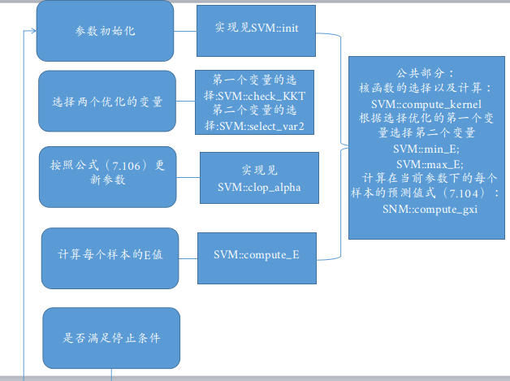

# SMO最优化算法
svm的原理其实还是很简单的，本身是一个凸二次规划问题，因此具有全局最有解，这也是svm很大的一个优势，但是数据量很大的化，其优化还是很费时的，因此有人提出smo算法，>私以为smo算法是很核心的一部分，基本上要实现得熟悉smo算法。

# smo算法过程
smo算法是一种启发式的算法，主要思想是如果所有的变量都满足KKT条件，那么这个最优化
的问题的解就得到了，也即KKT条件是最优化问题的充分必要条件。因此优化时只需要选择>不满足KKT条件的变量去优化，可以先选择两个变量去优化，也就是常见的二元二次规划，>我们都很熟悉，可以直接求解。
# 实现步骤
按照《统计学习方法》李航实现。[SVM实现](https://github.com/wwbin2017/machine_learning/tree/master/svm)

```C++
#include<string>
using namespace std;

class SVM
{
private:
  float* alpha;
  float* E; //E值的计算
  float** sample; //样本
  float* label;   //标签
  float C;     //惩罚参数
  float b;     // 常数项
  float theta;  // 浮点比较精度
  float precision;  // 迭代停止精度
  int sample_n; //样本总数
  int field_n;  // 特征个数
  string kernel;  // 核函数的选择
public:
  SVM();
  SVM(const string& file_name,float C, const string& kernel,float precision);
  void init(const string& file_name,float C, const string& kernel, float precision);
  ~SVM();
  void smo(int iter_num, float precision);
  void solve_min(int var_1, int var_2);
  void clop_alpha(int var_1, int var_2, float new_alpha_2);
  float compute_v(int index, int var_1, int var_2);
  void compute_E();
  int select_var2(int index);
  int min_E(int id);
  int max_E(int id);
  bool check_KKT(int& index_2);
  float compute_gxi(int index);
  float compute_kernel(int index_1, int index_2);
  float compute_kernel_feature(float* index_1, float* index_2);
  void save_model(const string& path);
  void load_model(const string& path);
  float predict(float* feature);
};
```
