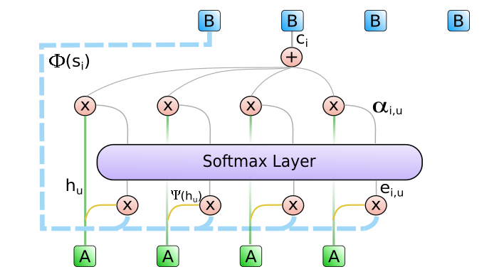
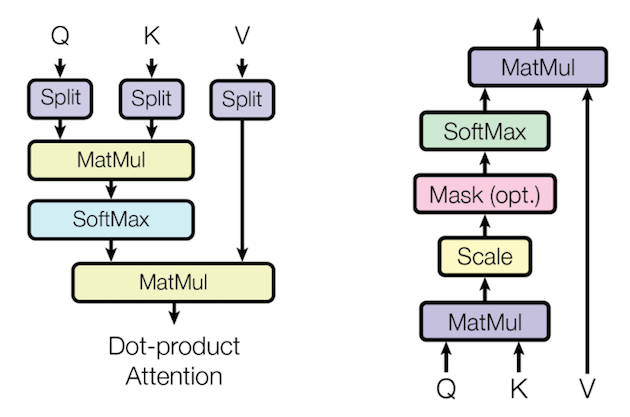
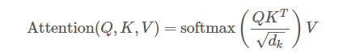
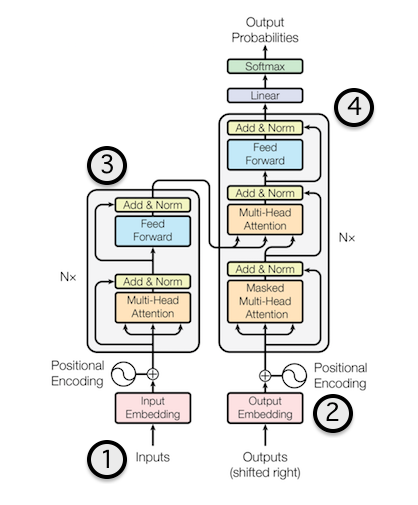
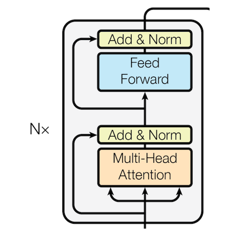
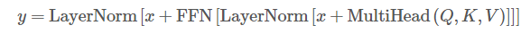
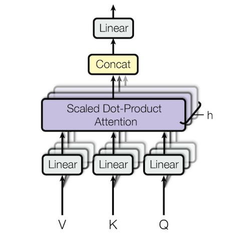
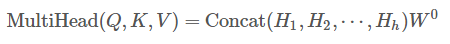
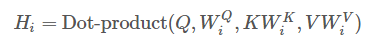
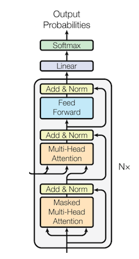

### All you need is attention
### 亮点
* 提出了一个新模型，named Transformer，没有使用CCN和RNN，基于Attention机制
* 介绍了multi-head attention mechanism
* 一个新的位置编码
* 也是一个seq2seq模型
* 也是一个自回归模型，输出不经依赖输入也依赖以前的输出
* 在翻译上取得了state-of-the-art 最优结果

### attention的好处
* CNN需要叠加多层才能获得全局的一个表达
* RNN序列模型，训练很慢

### 基本attention机制

attention的一个基本思想就是当前的一个输出是和前面所有的输入中的特定输入有关系。因此就是需要取得一个输入的加权和。一个基本的做法就是上一时刻的输出和所有输入求得一个权重，然后加权和。因此是有所偏重的即注意力机制。

Q，K，V放到翻译模型里面可以认为分别为上时刻的输出，所有输入，所有输入

#### transformer
论文中的模型结构如下

#### 输入输出
* 像一般模型一样，做了一个embedding，dmodel=512

#### 位置编码
* 把位置编码和dmodel一样的维数，并且相加，加入位置信息
* 在训练阶段为了防止信息泄露，加入负无穷

#### encoder
叠加N层

##### Multi-head attention 机制

其实直白的讲就是首先做一个相性变换，使得输入不一样，然后，重复多个attention，最后拼接一起。其实这里类似CNN的多个卷积核，提取不同特征，丰富模型的表达能力。

##### 加入了一些常用技巧
* Residual connections
* Layer normalization

##### decoder
解码层与编码层基本一样，只不过为了防止信息泄漏，增加了一个masked multi-head attention，其实就是对未来的一个信息设置为负无穷，使得未来的信息不会出现在当前时刻里面。

主要参考[链接](https://ricardokleinklein.github.io/2017/11/16/Attention-is-all-you-need.html)，加入了一些自己的理解。
